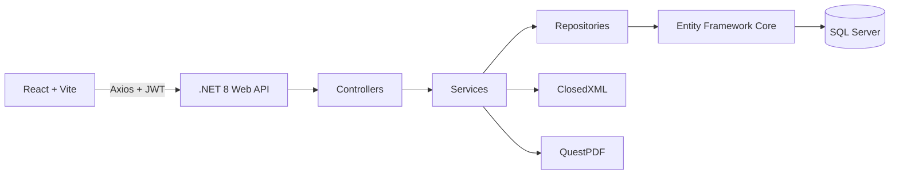

# SIGTA

## Sistema de Gestión de Turnos y Asistencia

SIGTA es una plataforma empresarial full-stack para administrar empleados, planificar turnos, registrar asistencia, calcular horas trabajadas y analizar el rendimiento operativo de una organización.

El sistema centraliza el ciclo completo de trabajo:

```text
Empleados → Horarios → Asistencia → Horas trabajadas → Dashboard → Reportes
```

Está diseñado como un proyecto de portafolio profesional, con reglas de negocio reales, autorización por roles, SQL Server, exportación de reportes, calendario operativo y tests automatizados.

---

## Qué problema resuelve

Una empresa necesita saber quién trabaja, cuándo debe trabajar, quién asistió, cuánto tiempo trabajó y qué tan cerca estuvo de cumplir su jornada programada.

SIGTA permite responder esas preguntas desde un solo sistema:

- Qué empleados están activos.
- Qué turnos tiene asignados cada persona.
- Quién registró entrada y salida.
- Quién llegó tarde o salió antes de tiempo.
- Cuántas horas fueron programadas y cuántas se trabajaron.
- Qué empleados o áreas tienen bajo cumplimiento.
- Qué información debe exportarse para supervisión y reportes.

---

## Funcionalidades

### Autenticación y usuarios

- Login con JWT.
- Registro de usuarios desde la interfaz administrativa.
- Cambio de contraseña.
- Consulta de perfil.
- Activación y desactivación de cuentas.
- Redirección automática al login cuando expira el token.
- Cierre de sesión desde el menú superior y el panel lateral.

### Roles y permisos

#### Administrador

- Acceso total al sistema.
- Gestión de empleados.
- Gestión de usuarios.
- Gestión de áreas, cargos y turnos.
- Asignación y eliminación de horarios.
- Dashboard global.
- Reportes globales.

#### Supervisor

- Consulta empleados, horarios y asistencia.
- Asignación individual y masiva de horarios.
- Registro de asistencia de empleados.
- Dashboard global.
- Reportes operativos.
- No puede eliminar horarios ni administrar usuarios.

#### Empleado

- Dashboard personal.
- Consulta de sus horarios.
- Consulta de su asistencia.
- Registro de su propia entrada y salida.
- Consulta de su resumen mensual.
- No puede consultar información global ni administrar otros empleados.

La autorización se aplica en dos niveles:

- Frontend: oculta navegación y acciones no permitidas.
- Backend: valida roles y propiedad de los datos aunque el endpoint sea invocado directamente.

### Gestión de empleados

- Alta de empleados.
- Edición de información personal y laboral.
- Búsqueda por nombre o documento.
- Asociación con área y cargo.
- Activación y desactivación.
- Paginación real.
- Validación de documento duplicado.

### Catálogos administrativos

CRUD protegido para:

- Áreas.
- Cargos.
- Tipos de turno.
- Hora de inicio y finalización.
- Horas esperadas.
- Activación y desactivación sin eliminar históricos.

### Gestión de horarios

- Asignación individual.
- Asignación masiva por área.
- Rango de fechas.
- Sobrescritura opcional de horarios existentes.
- Validación de duplicados por empleado y fecha.
- Filtros por área y fechas.
- Paginación en la vista de lista.
- Eliminación restringida al Administrador.
- Vista lista.
- Vista semanal.
- Vista mensual.
- Calendario visual con turnos, empleados y horas.

### Control de asistencia

- Registro de entrada.
- Registro de salida.
- Validación de entrada duplicada.
- Bloqueo de salida si no existe una entrada activa.
- Detección automática de tardanza con tolerancia de 15 minutos.
- Detección de salida temprana.
- Cálculo de horas trabajadas.
- Estado de jornada actual.
- Filtros por fecha y estado.
- Paginación real.
- Resumen mensual por empleado.
- Registro personal para el rol Empleado.

### Dashboard

El Dashboard consume datos reales de horarios y asistencia.

Indicadores principales:

- Empleados activos.
- Horarios programados.
- Asistencias registradas.
- Horas trabajadas.
- Tardanzas.
- Cumplimiento general.
- Cumplimiento por área.
- Tendencia de horas productivas.

Filtros disponibles:

- Hoy.
- Semana.
- Mes.

El dashboard se actualiza:

- Al cambiar el rango seleccionado.
- Automáticamente cada 30 segundos.
- Manualmente mediante el botón de actualización.

El Empleado recibe un dashboard personal con su jornada y resumen mensual.

### Reportes

#### Reporte de horas por empleado

- Días programados.
- Días asistidos.
- Horas programadas.
- Horas trabajadas.
- Horas extras.
- Horas faltantes.
- Tardanzas.
- Porcentaje de cumplimiento.

#### Reporte detallado de asistencia

- Fecha.
- Empleado.
- Área.
- Hora de entrada.
- Hora de salida.
- Horas trabajadas.
- Minutos de retraso.
- Estado de asistencia.

Formatos disponibles:

- JSON para la vista previa.
- Excel `.xlsx` mediante ClosedXML.
- PDF mediante QuestPDF.

---

## Stack tecnológico

### Backend

- .NET 8 Web API.
- Entity Framework Core 8.
- SQL Server.
- JWT Bearer Authentication.
- BCrypt para contraseñas.
- ClosedXML para Excel.
- QuestPDF para PDF.
- Swagger/OpenAPI.

### Frontend

- React 18.
- Vite.
- React Router.
- Axios.
- Lucide React.
- CSS con sistema visual Enterprise Editorial.
- Diseño responsive para desktop y mobile.

### Testing

- xUnit.
- Moq.
- Microsoft.AspNetCore.Mvc.Testing.
- Tests unitarios.
- Tests de autorización.
- Tests de integración HTTP.

---

## Arquitectura



Estructura principal:

```text
SIGTA/
├── Controllers/              Endpoints HTTP
├── Data/                     DbContext y seed de desarrollo
├── Extensions/               Inyección de dependencias, JWT y Swagger
├── Helpers/                  Utilidades compartidas
├── Middleware/               Manejo global de errores
├── Migrations/               Migraciones Entity Framework
├── Models/
│   ├── Entities/             Entidades de base de datos
│   └── DTOs/                 Requests y Responses
├── Repositories/             Acceso a datos
├── Services/                 Reglas de negocio y reportes
├── frontend/                 Aplicación React + Vite
└── tests/                    Tests automatizados
```

---

## Requisitos

- .NET SDK 8 o superior.
- Node.js 18 o superior.
- SQL Server Express o SQL Server Developer.
- SQL Server Management Studio recomendado.

Configuración local:

```text
Servidor SQL: localhost\SQLEXPRESS
Base de datos: WorkForceManagerDB
API: http://localhost:5000
Frontend: http://localhost:5173
```

---

## Instalación y ejecución

### Base de datos

Crear la base de datos vacía en SQL Server:

```sql
CREATE DATABASE WorkForceManagerDB;
```

Las migraciones se aplican automáticamente cuando la API se ejecuta en entorno `Development`.

### User Secrets para desarrollo

Desde la raíz del proyecto:

```powershell
dotnet user-secrets init
dotnet user-secrets set "ConnectionStrings:DefaultConnection" "Server=localhost\SQLEXPRESS;Database=WorkForceManagerDB;Trusted_Connection=True;TrustServerCertificate=True;"
dotnet user-secrets set "JwtSettings:SecretKey" "una-clave-local-larga-y-aleatoria-de-32-o-mas-caracteres"
dotnet user-secrets set "Cors:AllowedOrigins:0" "http://localhost:5173"
```

Los secretos se almacenan fuera del repositorio.

### Backend

```powershell
$env:DOTNET_ROLL_FORWARD="Major"
dotnet run
```

API:

```text
http://localhost:5000
```

Swagger:

```text
http://localhost:5000/swagger
```

### Frontend

En otra terminal:

```powershell
cd frontend
npm install
npm run dev
```

Frontend:

```text
http://localhost:5173
```

Para cambiar la URL de la API, copia `frontend/.env.example` a `frontend/.env` y modifica `VITE_API_URL`.

---

## Usuarios demo

Se crean en entorno de desarrollo:

| Rol | Email | Contraseña |
|---|---|---|
| Administrador | `admin@workforce.local` | `Admin123!` |
| Supervisor | `supervisor@workforce.local` | `Super123!` |
| Empleado | `empleado@workforce.local` | `Empleado123!` |

Estas credenciales son exclusivamente para desarrollo local y deben cambiarse antes de publicar el sistema.

---

## API principal

### Autenticación

```text
POST /api/Auth/login
POST /api/Auth/register
GET  /api/Auth/perfil
GET  /api/Auth/usuarios                  Administrador
GET  /api/Auth/usuarios/opciones         Administrador
```

### Empleados

```text
GET    /api/Empleados
GET    /api/Empleados/{id}
POST   /api/Empleados
PUT    /api/Empleados/{id}
PATCH  /api/Empleados/{id}/activar
PATCH  /api/Empleados/{id}/desactivar
```

### Horarios

```text
GET    /api/Horarios
POST   /api/Horarios
POST   /api/Horarios/asignacion-masiva
DELETE /api/Horarios/{id}
```

### Asistencia

```text
GET  /api/Asistencia
POST /api/Asistencia/entrada
POST /api/Asistencia/salida
GET  /api/Asistencia/estado-hoy/{empleadoId}
GET  /api/Asistencia/resumen/{empleadoId}
```

### Dashboard

```text
GET /api/Dashboard/resumen
GET /api/Dashboard/areas
GET /api/Dashboard/tendencia
```

Los endpoints aceptan rangos mediante `fechaInicio` y `fechaFin`.

### Reportes

```text
GET /api/Reportes/horas
GET /api/Reportes/horas/excel
GET /api/Reportes/horas/pdf
GET /api/Reportes/asistencia
GET /api/Reportes/asistencia/excel
GET /api/Reportes/asistencia/pdf
```

---

## Tests

Ejecutar todos los tests:

```powershell
$env:DOTNET_ROLL_FORWARD="Major"
dotnet test tests\WorkForceManagerAPI.Tests\WorkForceManagerAPI.Tests.csproj
```

La suite valida:

- Claims JWT.
- Cálculo de tardanzas.
- Entradas duplicadas.
- Autorización por rol.
- Protección de datos propios del Empleado.
- Autenticación requerida en endpoints HTTP.

Resultado actual: **14 tests correctos**.

---

## Seguridad y producción

- La `SecretKey` JWT no está en `appsettings.json`.
- La cadena de conexión no está en `appsettings.json`.
- El desarrollo utiliza User Secrets.
- Producción debe usar variables de entorno o un secret manager.
- CORS se configura mediante `Cors:AllowedOrigins`.
- El frontend redirige al login cuando el token expira.
- Los endpoints administrativos tienen autorización por rol en backend.
- Antes del despliegue deben cambiarse las credenciales demo.
- Debe habilitarse HTTPS.
- Debe actualizarse cualquier dependencia con vulnerabilidades reportadas.

---

## Estado y próximos pasos

SIGTA ya cubre el flujo funcional completo de gestión:

```text
Empleado → Horario → Entrada/Salida → Cálculo de horas → Dashboard → Reporte
```

Próxima etapa:

- Configurar Docker o el proveedor cloud elegido.
- Publicar la API y SQL Server.
- Publicar el frontend.
- Configurar dominio, HTTPS, CORS y secretos de producción.
- Automatizar build y tests con GitHub Actions.

---

## Licencia

Proyecto de portafolio personal.
